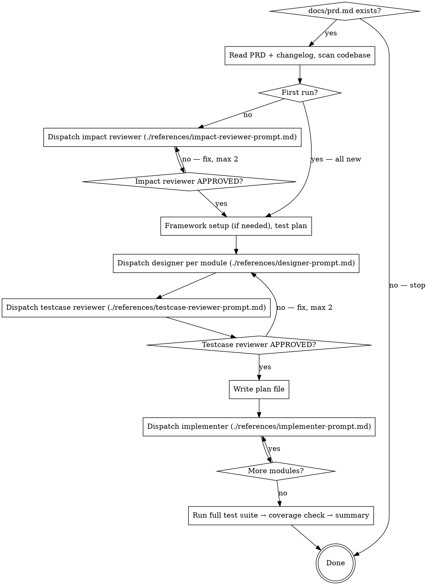

# Unit Test

PRD-driven unit testing with review gates. Tests are designed from requirements, reviewed before implementation, then dispatched to subagents.

## The Process



## Core Principle

```
PRD defines WHAT to test (requirements → test cases)
Business code defines HOW to test (implementation → assertions)
Design first, code second — review gates prevent wasted effort
```

**Two types of code, two failure modes:**

| | Test code | Business code |
|---|-----------|---------------|
| **What** | Test case source (`*.test.*`) | Application source being tested |
| **On failure** | Fix the test code | Mark as test failure, record bug |
| **Never** | — | Modify business code |

---

## Role Boundaries

| Role | Only does | Never does |
|------|-----------|------------|
| Lead | Module-level: impact analysis, test plan, dispatch & coordination | TC-level design, TC add/update/delete evaluation |
| Impact reviewer | Verify affected module list completeness | TC-level evaluation, testcase design |
| Designer | TC-level: design testcase docs, evaluate TC add/update/delete | Write test code, modify business code |
| Testcase reviewer | Validate TC quality and add/update/delete decisions | Modify testcase docs directly |
| Implementer | Write test code, run tests, write back results (Status/Last run only) | Modify business code, modify testcase design content (Type/Scenario/Input/Expected) |

## Exception Handling

| Exception | Action |
|-----------|--------|
| `docs/prd.md` does not exist | Stop. PRD is required — ask user to create it or use prd-keeper skill |
| `docs/prd-changelog.md` does not exist | Treat as first run — no changes to track, all modules are new |
| Review still rejected after 2 rounds | Lead proceeds with current version, records unresolved issues in plan file |
| Designer/Implementer subagent crashes or times out | Lead re-dispatches once. If fails again, skip module, record in plan file |
| Step 5 regression in unaffected module | Impact analysis missed it — add to affected list, go back to Step 3 for that module |

---

## Step 1: Context & Impact Analysis

1. Read `docs/prd.md` and `docs/prd-changelog.md` — understand requirements and recent changes
2. Scan business code directories — map modules, dependencies, complexity
   - **Module granularity**: follow the project's natural boundaries (a service class, a file, a package). One module = one testcase doc. If unsure, match the unit the project already organizes around (e.g., one file per class → one module per class)
3. If existing tests found: read 2–3 test files, learn conventions (naming, directory, assertions, mocking)
4. If `docs/testmaster/testcase/` does not exist (first run): all modules are new, skip to Step 2
5. **Impact analysis** (when `docs/testmaster/testcase/` exists):
   - From changelog: identify what requirements changed → what business code was modified
   - From code: analyze which modules depend on the modified code (callers, importers, inheritors)
   - Produce affected module list with dependency evidence
6. Dispatch **impact reviewer** subagent — see `references/impact-reviewer-prompt.md`
   - Validates: affected list completeness by independently checking code dependencies
   - If rejected: add missing modules, re-submit (max 2 rounds)

## Step 2: Framework Setup

If project already has test infrastructure, **skip this step**.

1. Detect tech stack → select mainstream framework:
   - Choose frameworks with mature ecosystems, rich documentation, large community
   - Avoid bleeding-edge (unstable) or deprecated (unmaintained)
   - When in doubt, pick the one with more adoption
2. **Set up test infrastructure**:
   - Install dependencies (test framework, assertion library, mock library)
   - Create config file (jest.config, vitest.config, pytest.ini, etc.)
   - Create test directory structure
   - Run a trivial test to verify setup — if it fails, fix or pick next best option

## Step 3: Test Plan, Case Design & Persist

1. **Test plan**:
   - Map PRD requirements → business code modules
   - Identify mock boundaries: external APIs, DB, file I/O, time, randomness
   - Priority: high (business logic / domain) → medium (API / data layer) → low (utils)
   - Skip list: generated code, pure types, config constants, thin wrappers
2. Dispatch **designer subagent** per module — see `references/designer-prompt.md`
   - **New module**: read PRD + business code, design all TCs from scratch
   - **Affected module**: read existing testcase doc + changed business code, evaluate per TC:
     - TC tests unchanged code → keep as-is
     - TC tests changed behavior → update Expected/Input/Scenario
     - TC tests removed code → delete TC
     - New code/behavior added → add new TCs
   - **Unaffected module**: not dispatched
   - Output: testcase doc per `references/testcase-format.md`
3. Dispatch **testcase reviewer** subagent — see `references/testcase-reviewer-prompt.md`
   - Validates: coverage completeness, mock strategy, missing edge cases
   - For affected modules: also validates TC add/update/delete decisions
   - If rejected: lead re-dispatches designer with reviewer feedback (max 2 rounds)
4. Write plan file to `docs/testmaster/plans/YYYY-MM-DD-HHmmss-unit-test.md`:

```markdown
## Context
- Tech stack: [detected]
- Test framework: [selected, verified]
- Conventions: [learned from existing tests]
- Run command (all): [command]

## Mock Boundaries
[Step 3 mock strategy]

## Modules
- [ ] module-a → docs/testmaster/testcase/module-a.md (new)
- [ ] module-b → docs/testmaster/testcase/module-b.md (affected — [reason])

## Skipped (unaffected)
- module-c
```

## Step 4: Implementation Dispatch

For each module in the plan:

1. Create a task (TaskCreate) per module
2. Dispatch a **general-purpose subagent** per module — see `references/implementer-prompt.md`
   - Reads testcase doc + business code file
   - Writes test code following project conventions
   - Runs tests, fix loop (max 5 rounds) — diagnose each failure:
     - Test code bug (wrong mock, bad assertion, typo) → fix test code
     - Business code bug (actual defect) → don't touch, mark as failure, record in report
     - Can't determine → treat as business code bug
   - Reports: files created, test count, pass/fail, business code bugs found
3. **Write results back** to `docs/testmaster/testcase/[module-name].md` — update `Status` and `Last run`:
   - `✅ PASSED` / `❌ FAILED — [reason]` (add `Actual` field) / `🔍 NEEDS_REVIEW`
   - See `references/testcase-format.md` for all status values
4. Update plan checklist after each subagent completes

## Step 5: Aggregate & Report

1. Run full test suite (old + new) — check regressions
2. If regressions found: dispatch subagent to fix **test code only** (never business code)
3. Coverage check: default targets line >= 80%, branch >= 70% (project may override in plan file) — shortfall recorded, not forced
4. **Completion checklist** — all confirmed before done:
   - [ ] Every test file actually ran (not just written)
   - [ ] All test code bugs fixed — remaining failures are confirmed business code bugs
   - [ ] Failed tests stay as-is (no skip/xfail) — tests reflect real system state
   - [ ] Coverage recorded
   - [ ] All testcase docs have Status written back (✅/❌/🔍)
5. Output summary: framework, modules, test count, passed, failed (business code bugs), coverage

---

## Resume

Read latest `docs/testmaster/plans/*-unit-test.md` + scan `docs/testmaster/testcase/`.

- **No plan or testcase docs**: start from Step 1
- **Plan + testcase docs exist**: skip to Step 4, resume from first incomplete module
- **Plan exists, no testcase docs**: resume from Step 3

---

## Red Flags

**Never:**
- Run tests (`pnpm test`, `npm test`, `pytest`) before Step 5 — implementer subagents run per-module tests in Step 4, full suite in Step 5
- Write test code (`.test.` files) before testcase docs are reviewed and approved
- Scan code or write tests without having read PRD first
- Skip reviewer dispatch because "it's obvious" or "project is simple"
- Modify business code — test code bug → fix test; business code bug → record it, never modify
- Design and code simultaneously — design the testcase doc first, then implement
- Proceed to next step without completing current step's artifact

**If reviewer finds issues:**
- Designer (same subagent) fixes them
- Reviewer reviews again
- Repeat until approved or max 2 rounds
- Don't skip the re-review

**Test quality:**
- Mock returns X, assert X → testing the mock, not the logic
- One happy-path test per function → must cover boundaries and errors
- Guessing what to test → PRD tells you what matters
- Testing database data directly → unit tests mock the DB layer
